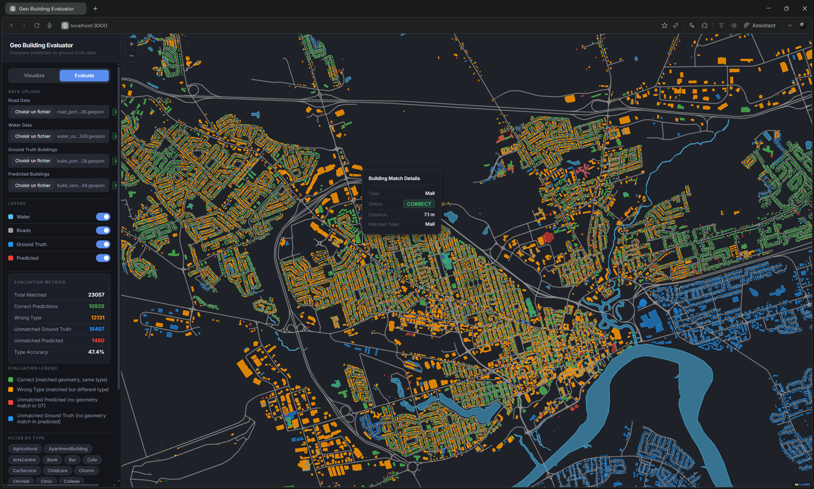

# Geo Building Evaluator

A local tool to compare processed building data against a ground truth and evaluate building type accuracy.

## Install & Run
```bash
git clone https://github.com/ElhadjDt/geo-building-evaluator.git
cd geo-building-evaluator
```
```bash
npm install
npm run dev
```

Open **http://localhost:3002** in your browser.

---

→ **[Read the full documentation](./docs/ARCHITECTURE.md)**


